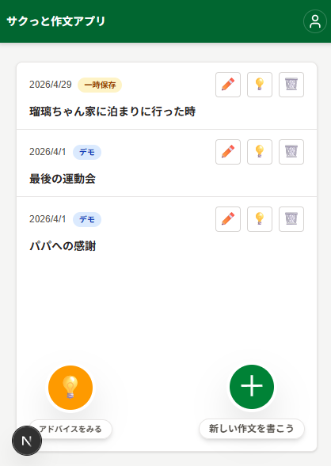
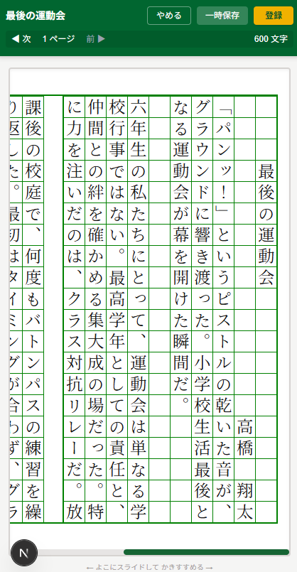
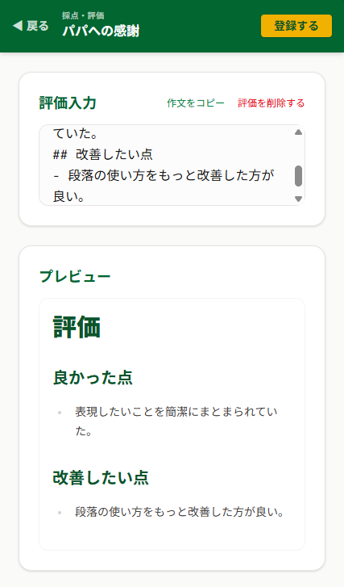
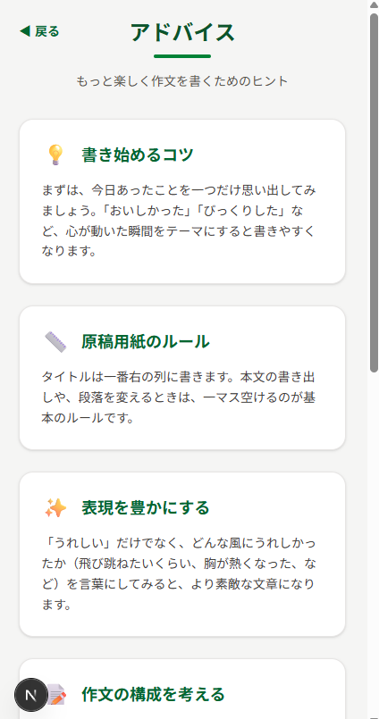

# サクっと作文 (Sakutto Sakubun)

**「原稿用紙に書く楽しさを、デジタルでも。」**  
子供たちの文章作成を支援する、ブラウザ完結型のリアルタイム縦書き作文アプリケーションです。

## 🚀 デモ・ログイン情報

以下のURLから実際に操作いただけます。企業担当者様向けのデモアカウントを用意しております。

- **URL:** [https://sakubun-flax.vercel.app/](https://sakubun-flax.vercel.app/)
- **ID:** `demo`
- **Password:** `demo`

---

## 📸 画面イメージ

### 1. ログイン・トップ画面

簡易的ではありますが認証機能を採用しています。

### 2. 下書き・作品一覧

保存した作品をいつでも編集・閲覧・管理できます。

### 3. 縦書き原稿用紙エディタ

本物の原稿用紙に書いているような感覚で、リアルタイムに文字が配置されます。

### 4. 評価画面

作文の達成度や評価ポイントを視覚的に確認し、振り返りを行うことができます。

### 5. アドバイス画面

AIや保護者からのフィードバックを通じて、子供たちのモチベーションを高め、次の執筆へのヒントを提供します。

## � 技術的な見どころ（エンジニア視点）

本プロジェクトでは、Web標準では実装が困難な「縦書き原稿用紙」のUI/UXを実現するために、以下の技術的工夫を行っています。

### 1. 独自の縦書きレンダリングエンジン

HTMLの `writing-mode: vertical-rl` と `textarea` を組み合わせつつ、原稿用紙の「マス目」に文字を正確に配置するため、フォントサイズとラインハイトの動的計算ロジックを実装しています。

### 2. インテリジェントな自動改ページ処理

文章の途中に文字を挿入した際、1ページ（400文字）を超えた分を**自動的に2ページ目以降へ流し込む（オーバーフロー処理）**アルゴリズムを自作しました。バイナリサーチを用いた文字位置計算により、大量の文章入力時でも低遅延な入力を維持しています。

### 3. モバイル・ファーストの操作性

スマホでのドラッグスクロールと、`textarea` 内部のイベントキャプチャを両立させ、PC・スマホ両方で直感的な操作感を実現しました。

---

## ✨ 主な機能

- **リアルタイム縦書き入力:** 原稿用紙のマス目に合わせたリアルタイムな文字描画。
- **下書き・本登録機能:** 執筆途中の保存と、完成後の作品一覧管理。
- **自動文字数カウント:** ページを跨いだ総文字数のリアルタイム集計。
- **アドバイス機能:** 子供たちの執筆を助けるガイド機能（実装予定/一部実装）。
- **レスポンシブ対応:** 横長・縦長どちらのデバイスでも原稿用紙の質感を維持。

---

## 🏗 使用技術スタック

| カテゴリ       | 技術                         |
| :------------- | :--------------------------- |
| **Frontend**   | React / Next.js (App Router) |
| **Styling**    | Tailwind CSS / CSS Modules   |
| **Language**   | TypeScript                   |
| **Deployment** | Vercel                       |

---

## 💡 開発の背景

「親子で楽しく作文に取り組める環境を作りたい」という想いからスタートしました。  
従来のデジタル作文ツールは「横書きのメモ帳」に近いものが多く、小学校で習う「原稿用紙の使い方」を学ぶには不十分でした。本アプリは、マスの使い方（句読点の位置や改行ルール）を視覚的に意識できる設計にこだわっています。

---

## 👤 開発者情報

**[中軍 武]**  
フリーランスエンジニアとして、React/Next.jsを中心としたモダンなWebフロントエンド開発を得意としています。UI/UXの細部へのこだわりと、複雑な状態管理をシンプルに保つ設計を重視しています。

---

© 2024 Sakutto Sakubun Project
